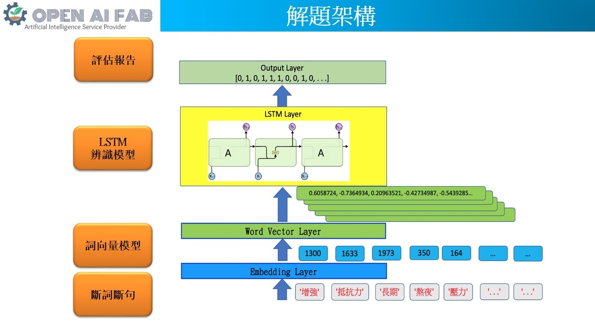
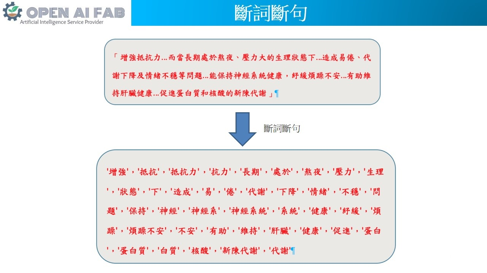
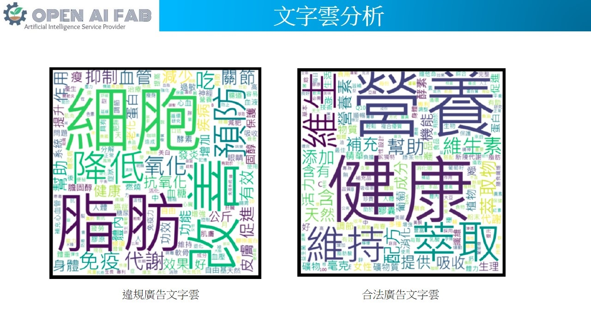
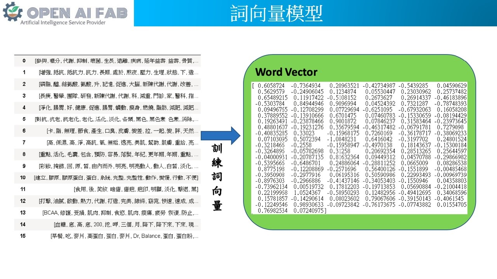
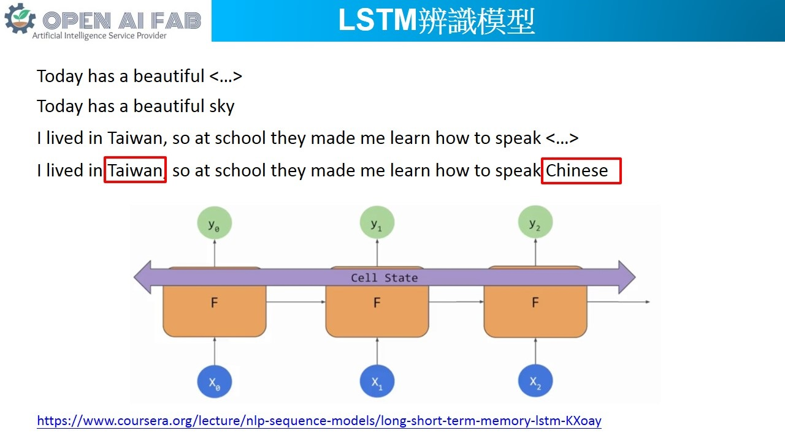

## 簡介
食品違規廣告為最常見且每年違規案件數量居高不下。依衛福部統計，2016年至2018年，全台每年違規食品廣告裁處案件數年年超過4千件，僅台北市2018年全年即裁罰達3,347萬元。由於食品廣告態樣及用語繁多，主管機關人力有限，相關業者亦難以事前預料該廣告是否合規，加上食品市場競爭激烈，往往在食品廣告推出後，而遭到裁罰，影響到食品業者及消費者權益。  
開源智造為了解決客戶痛點，與客戶一同合作，完成「AI食品廣告文字辨識分析」的研究。透過AI自動化文字判讀系統，協助食品業者偵測該廣告用語是否符合食藥署規定，並對違規情形予以示警，以減少或避免違規。  

## 系統架構
如下圖包含(1) 斷詞斷句、(2) 詞向量模型、(3) LSTM模型、 (4) 最終要給使用者的評估報告。  
  

## 斷詞斷句
為了要讓機器能理解一段冗長的廣告敘述，首先必須要先將整篇廣告做斷詞斷句，讓機器知道這則廣告有哪些「元素」，接著機器才能進一步用這些元素的出現次數等統計數據，跟違規廣告中的元素進行比對，以觀察該則廣告跟違規廣告的相似程度，用來判斷目標廣告是否違規。斷詞斷句本身就是一個複雜的模型，感謝Open Source AI，已經有免費且高穩定性的斷詞斷句的Jieba，讓我們可以快速地從library中直接取用其功能，將輸入的文章切割成基本單元，如圖所示，上面這一串很長的文章經過斷詞斷句後，會變成很多詞句的組合。  
  

## 文字雲
經過斷詞斷句後，我們進一步將所有違規廣告中所出現的字詞做分析，了解哪些詞彙經常出現在違規廣告中，並以文字雲的方式呈現。  
我們也針對合法廣告做了文字雲分析，不難看出在合法廣告文字雲中常出現的字眼是相當中性的，並不會踩到違規廣告的紅線- 誇大不實或是提到醫療效果。  
  

## 詞向量模型
經過Jieba的斷詞斷句後，每一則廣告都變成一組很多element的array。接下來最簡單的方式是將每個array 變成相同長度，element數量是所有詞彙的總集合，而每個array 用one-hot 的方式來代表該則廣告含有哪些字詞。然而，我們可以想像這樣的array 的大小將會變得非常長，而其中的element卻有很多的0，所有的array 會組成一個稀疏矩陣。為了有效利用數位資源和減輕機器運算的負擔，我們訓練一個詞向量模型，將這樣稀疏的矩陣作轉換，每則廣告用一個較短的向量即可充分表示該廣告所包含的內容，如圖的範例所示。  
  

## LSTM模型
早期在做NLP的應用時，用最傳統的RNN網路會遇到一些問題。如這個克漏字填空，Today has a beautiful空格，演算法可以知道要填sky，但如果是較長的句子I lived in Taiwan, so at school they made me learn how to speak 空格，我們知道要填Chinese，但是傳統的RNN演算法可能就不知道要填什麼了，因為句子太長演算法已經忘掉前面的Taiwan這個字。LSTM就是在RNN網路內加入記憶cell的一種進化版演算法，他可以知道前面的句子發生了什麼事，在雙向的LSTM甚至可以記憶後面的句子發生了什麼事。  
  

## References
Jieba斷詞斷句： https://github.com/fxsjy/jieba  
Gensim word2vec： https://radimrehurek.com/gensim/models/word2vec.html  

## download large size model from here
https://drive.google.com/open?id=1qeuag5QXbfmm6ckbdaqC8S_cBV9E7--e  
https://drive.google.com/open?id=1n5pq-cOHllHxRaXmwdhW8Xgk-7iCNMLq  
